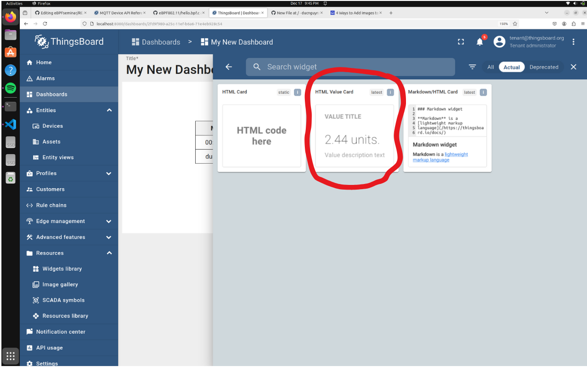
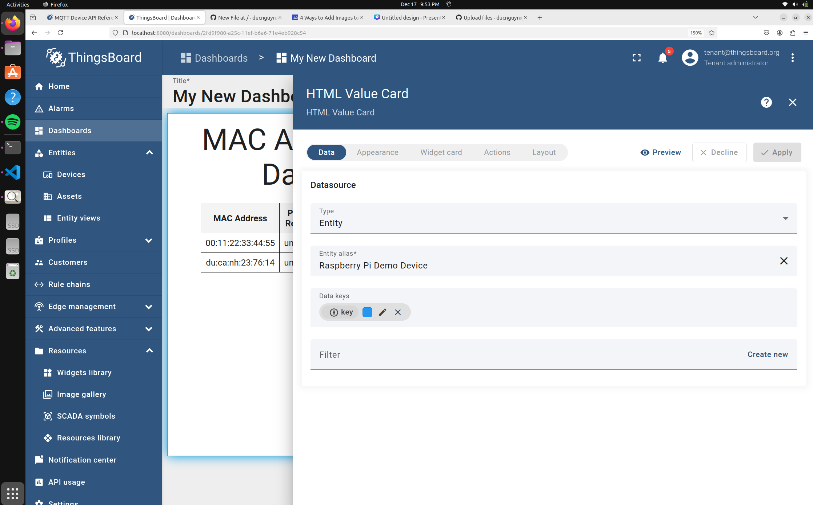
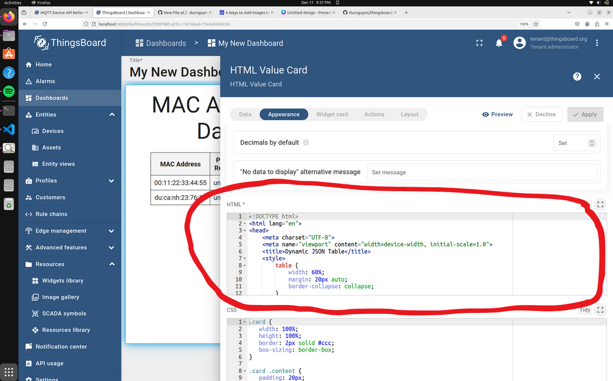

#### Update via MQTT  
```
mosquitto_pub -d -h "demo.thingsboard.io" -t "v1/devices/me/attributes" -u "<token>" -f "values.json" 
```
replace "<token>" with your token
### Add the widget to your dashboard  
  
### Modify the input attribute value  
  
### Modify the HTML code inside the Widget
 


